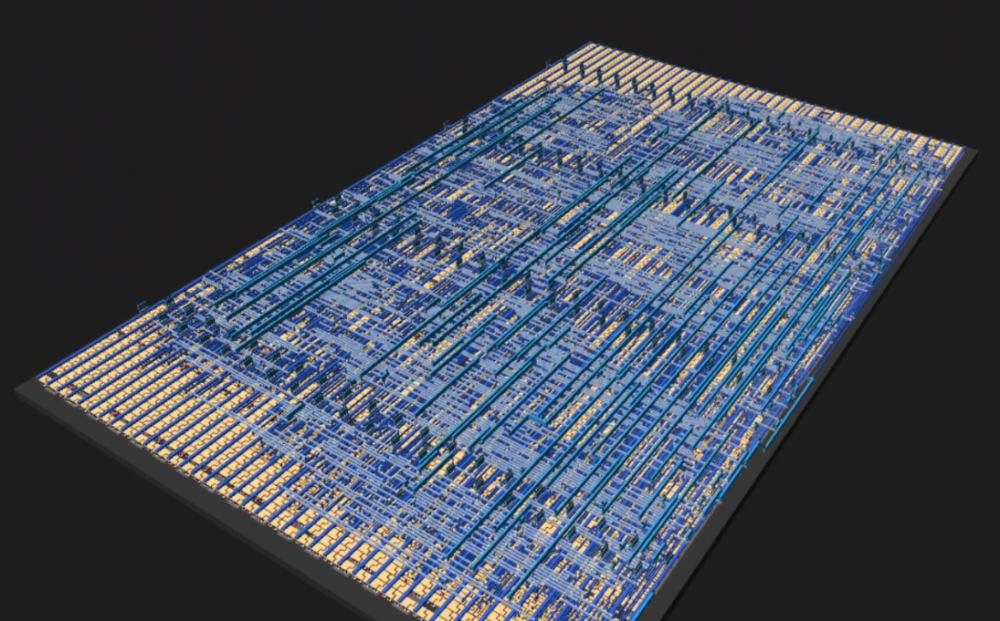

   

# Spacelizard APU

Spacelizard APU is a tiny 8-bit arithmetic processing unit designed for Tiny Tapeout.

It provides an 8-bit ALU, two registers, status flags, small RAM, and a simple command/data bus interface using the Tiny Tapeout pins.

## Features

- 8-bit accumulator register `A`
- 8-bit register `B`
- Flags: `Z`, `C`, `N`, `V`
- 8-byte internal RAM
- Arithmetic: add, subtract
- Logic: AND, OR, XOR, NOT
- Shifts and rotates
- Bidirectional `uio` data/status bus
- `uo_out[7:0]` continuously shows register `A`

## Interface

| Signal | Description |
|---|---|
| `ui_in[7]` | `EXEC` strobe |
| `ui_in[6:4]` | opcode |
| `ui_in[3:0]` | argument / RAM address |
| `uio_in[7:0]` | data input bus |
| `uio_out[7:0]` | data/status output bus |
| `uio_oe[7:0]` | output enable for `uio_out` |
| `uo_out[7:0]` | current value of register `A` |
| `clk` | clock |
| `rst_n` | active-low reset |
| `ena` | Tiny Tapeout enable |

## Command Format

Commands are sent on `ui_in`.

    ui_in[7]   = EXEC
    ui_in[6:4] = opcode
    ui_in[3:0] = arg

A command executes on the rising edge of `EXEC`.

Typical command sequence:

1. Put input data on `uio_in` if needed.
2. Put opcode and argument on `ui_in[6:0]`.
3. Set `ui_in[7] = 1`.
4. Clock once.
5. Set `ui_in[7] = 0`.

## Opcode Summary

| Opcode | Function |
|---|---|
| `000` | load / move / clear |
| `001` | arithmetic |
| `010` | logic |
| `011` | shifts / rotates |
| `100` | RAM write |
| `101` | RAM read into `A` |
| `110` | read register/status to `uio_out` |
| `111` | direct RAM read to `uio_out` |

## Instructions

### Opcode `000`: Load / Move / Clear

| Arg | Operation |
|---|---|
| `0` | `A = uio_in` |
| `1` | `B = uio_in` |
| `2` | `A = B` |
| `3` | `B = A` |
| `4` | `A = 0` |
| `5` | `B = 0` |

### Opcode `001`: Arithmetic

| Arg | Operation |
|---|---|
| `0` | `A = A + B` |
| `1` | `A = A + uio_in` |
| `2` | `A = A - B` |
| `3` | `A = A - uio_in` |

Arithmetic updates:

    Z = zero
    C = carry / no-borrow
    N = negative
    V = signed overflow

### Opcode `010`: Logic

| Arg | Operation |
|---|---|
| `0` | `A = A & B` |
| `1` | `A = A | B` |
| `2` | `A = A ^ B` |
| `3` | `A = ~A` |
| `4` | `A = A & uio_in` |
| `5` | `A = A | uio_in` |
| `6` | `A = A ^ uio_in` |

### Opcode `011`: Shifts / Rotates

| Arg | Operation |
|---|---|
| `0` | shift left |
| `1` | shift right |
| `2` | rotate left |
| `3` | rotate right |

Shift and rotate operations update the carry flag.

### Opcode `100`: RAM Write

    RAM[arg[2:0]] = uio_in

The RAM is 8 bytes, so only `arg[2:0]` is used.

### Opcode `101`: RAM Read Into A

    A = RAM[arg[2:0]]

### Opcode `110`: Read Register / Status

This opcode drives `uio_out`.

| Arg | Output |
|---|---|
| `0` | register `A` |
| `1` | register `B` |
| `2` | flags `{0000, V, N, C, Z}` |

### Opcode `111`: Direct RAM Read

    uio_out = RAM[arg[2:0]]

## Example

Load `A = 0x12`:

    uio_in = 0x12
    ui_in  = 0b10000000
    clock once
    ui_in  = 0b00000000

`uo_out` should now show:

    0x12

Load `B = 0x03`:

    uio_in = 0x03
    ui_in  = 0b10000001
    clock once
    ui_in  = 0b00000001

Add `A + B`:

    ui_in = 0b10010000
    clock once
    ui_in = 0b00010000

Result:

    A = 0x15
    uo_out = 0x15

## Testing

Run the cocotb testbench:

    make -C test

The testbench verifies:

- reset behavior
- register load
- addition
- subtraction
- zero flag
- carry flag
- negative flag
- overflow flag
- logic operations
- shifts
- RAM write/read
- direct RAM output

## Waveforms

The testbench generates:

    test/tb.vcd

Open it with:

    cd test
    gtkwave tb.vcd

Useful signals:

- `clk`
- `rst_n`
- `ui_in`
- `uio_in`
- `uio_out`
- `uio_oe`
- `uo_out`
- internal `A`
- internal `B`
- flags
- RAM entries

## Notes

The internal RAM is not reset to zero. This is intentional to reduce area and routing usage so the design can fit in a 1x1 Tiny Tapeout tile.

Software or test logic should write RAM before reading it.
